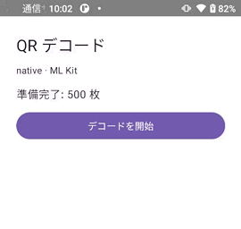
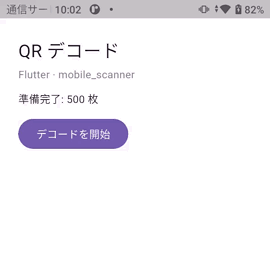
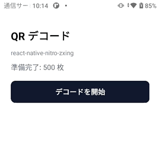

# qr — QR コードのデコード

同じリポジトリの 2 つ目の計測です。「アプリに同梱した QR コードの画像を 500 枚、順番にデコードする」時間を
native / Flutter / Expo で比べます。

カメラを使うと端末を手で動かす必要があり、agent-device でも自動化できません。
そこで、アプリの中に持っている画像を次々にデコードする形にしています。

**計測は実機のリリースビルドだけ**です（iPhone XR / Rakuten Hand 5G）。

```
qr/
├── images/            # 生成した QR 画像 500 枚（正本。各アプリへは sync-images.sh がコピー）
├── scripts/
│   └── sync-images.sh
├── native/
│   ├── ios/           # SwiftUI + Vision
│   └── android/       # Compose + ML Kit
├── flutter/app/       # mobile_scanner
└── expo/app/          # react-native-nitro-zxing
```

## 使うライブラリ

「React Native は `react-native-nitro-zxing`、ほかは各スタックの標準」という方針です。

| 実装 | ライブラリ | 中のエンジン |
| --- | --- | --- |
| native / iOS | Vision（`VNDetectBarcodesRequest`） | Apple Vision |
| native / Android | ML Kit Barcode Scanning（bundled） | ML Kit |
| Flutter | [`mobile_scanner`](https://pub.dev/packages/mobile_scanner) | iOS: Apple Vision / Android: ML Kit |
| Expo | [`react-native-nitro-zxing`](https://github.com/margelo/react-native-nitro-zxing) | zxing-cpp（Nitro の C++） |

**同じアルゴリズムの比較ではありません。** Flutter は native と同じエンジン（Vision / ML Kit）を
プラグイン越しに呼ぶので「プラグインの取り分」が見えますが、Expo だけは別物（zxing-cpp）を呼びます。
「各スタックで普通に選ぶものを使うと、どれくらい違うか」の比較です。

`react-native-nitro-zxing` はカメラ（VisionCamera）向けですが、静止画用の `scanCodesInImageAsync(image)` を
持っています。`react-native-nitro-image` の `loadImage({ filePath })` と組み合わせてカメラなしで使っています。

## 画像

`bench/scripts/make-qr-images.swift` が 512×512 の PNG を 500 枚作ります（Core Image と ImageIO だけを使うので
追加のツールは要りません）。中身は `https://example.com/benchmark/qr/<3 桁>` で 1 枚ずつ違い、
デコード結果が期待どおりかを番号で照合します。

正本は `qr/images/` だけをコミットし、各アプリのアセットへのコピーは `qr/scripts/sync-images.sh` が作ります
（`bench/scripts/build.sh` がビルド前に走らせます）。

```bash
swift bench/scripts/make-qr-images.swift qr/images 500 512
./qr/scripts/sync-images.sh
```

## アプリ（全実装で同じ）

画面は 1 つです。

1. 起動したら、同梱の 500 枚をアプリの書き込み領域へ展開する（**計測に含めない**）
2. 「デコードを開始」を押すと、展開したファイルを 1 枚ずつ**ファイルパスから**デコードする
3. 終わったら `デコード完了: 500 / 500`、合計ミリ秒、1 枚あたりのミリ秒を表示する

ファイルパスを入口に揃えているのは、`mobile_scanner.analyzeImage()` がパスしか受け取らないからです。
そのぶん PNG の読み込みとデコードも計測に入りますが、3 実装とも同じ条件です。

デコード中は `デコード中: <済み> / 500` と経過秒を出します。ループはカウンタを増やすだけにして、
画面の更新は 100 ms ごとの別のタイマーから行います（1 枚ごとに再描画するとその時間が計測に入るため）。

時刻はメモリに貯めて、ループが終わってからまとめてマーカーに出します。詳しくは [AGENTS.md](../AGENTS.md) の
「QR デコードのベンチマーク」を参照してください。

## 動作の様子

Rakuten Hand 5G で、3 実装を同じ 22 秒だけ録画したものです。同じ長さなので横に並べて読めます。
Expo（zxing-cpp）が 5 秒ほどで 500 枚を終えるのに対し、native と Flutter は 22 秒たってもまだ途中です。

| native（ML Kit） | Flutter（mobile_scanner） | Expo（nitro-zxing） |
| --- | --- | --- |
|  |  |  |

iPhone の録画はありません。agent-device が実機の iPhone から録画ファイルを取り出せませんでした
（`Failed to copy runner file from iOS device` / CoreDevice のコンテナ参照エラー）。iOS は数値だけです。

## 結果

<!-- qr:results:start -->

### iOS：iPhone XR 実機（iOS 18.7）

リリースビルド。500 枚を 1 回として、5 回の中央値（ウォームアップ 1 回を除く）。

#### ライブラリ

|  | native | Flutter | Expo |
| --- | ---: | ---: | ---: |
| デコーダ | Vision | mobile_scanner | nitro-zxing |

#### 時間

|  | native | Flutter | Expo |
| --- | ---: | ---: | ---: |
| 500 枚の合計 | 13544 ms | 16076 ms | 1882 ms |
| 1 枚あたり（中央値） | 26.44 ms | 30.26 ms | 3.57 ms |
| native を 1 とした比 | 1.00 | 1.14 | 0.14 |
| コールドスタート | 206 ms | 262 ms | 286 ms |

#### デコード結果・メモリ（RSS）・アプリサイズ

|  | native | Flutter | Expo |
| --- | ---: | ---: | ---: |
| デコードできた枚数（500 枚中） | 500 | 500 | 500 |
| デコード後のメモリ | 95.7 MB | 111.0 MB | 96.4 MB |
| .app（実機向け） | 4.1 MB | 18.1 MB | 40.7 MB |

### Android：Rakuten Hand 5G 実機（Android 11）

リリースビルド。500 枚を 1 回として、5 回の中央値（ウォームアップ 1 回を除く）。

#### ライブラリ

|  | native | Flutter | Expo |
| --- | ---: | ---: | ---: |
| デコーダ | ML Kit | mobile_scanner | nitro-zxing |

#### 時間

|  | native | Flutter | Expo |
| --- | ---: | ---: | ---: |
| 500 枚の合計 | 17441 ms | 17786 ms | 5116 ms |
| 1 枚あたり（中央値） | 32.80 ms | 34.71 ms | 9.70 ms |
| native を 1 とした比 | 1.00 | 1.06 | 0.30 |
| コールドスタート | 137 ms | 128 ms | 325 ms |

#### デコード結果・メモリ（PSS）・アプリサイズ

|  | native | Flutter | Expo |
| --- | ---: | ---: | ---: |
| デコードできた枚数（500 枚中） | 500 | 500 | 500 |
| デコード後のメモリ | 78.0 MB | 100.3 MB | 95.0 MB |
| APK | 25.4 MB | 61.7 MB | 106.4 MB |

<!-- qr:results:end -->

## 結果の読み方

- **zxing-cpp が大きく速い**という結果です。iPhone XR で 1 枚 3.57 ms（native の Vision は 26.44 ms）、
  Rakuten Hand 5G で 9.70 ms（native の ML Kit は 32.80 ms）。合計では iPhone で約 7 倍、Android で約 3.4 倍の差になります。
- **これは題材の性質が大きい**です。ここで読ませているのは、画面いっぱいに 1 つだけ、傾きも汚れもない
  合成の QR コードです。zxing-cpp は「与えられた画像を復号する」ライブラリなので素直に速く、
  Vision と ML Kit は「写真のどこにコードがあるかを探す」検出器なので、その探索のぶんが乗ります。
  カメラのフレームや、傾いた・小さく写った・複数写り込んだコードでは順位が変わりえます。
- **Flutter は native と同じエンジンを呼んでいるので、差はプラグインの取り分**です。
  iPhone で 30.26 ms / 26.44 ms（+14%）、Android で 34.71 ms / 32.80 ms（+6%）。
  1 枚ごとに Dart ↔ ネイティブを 1 往復するコストがこの程度、という読み方ができます。
- **デコードの成否は 3 実装とも 500 / 500** です。速さの差は精度を落とした結果ではありません。
- **アプリサイズは Expo が最も大きい**です（iOS 実機向けで 40.7 MB、Android で 106 MB）。
  nitro-zxing が peer 依存として `react-native-vision-camera` を要求するため、カメラを使わなくても入ります。
- コールドスタートは 3 実装とも同程度で、[ルートの計測](../README.md)と同じ傾向です。

## 計測をやり直す

```bash
cd bench
npm ci

# 実機向けのビルド（iOS は署名が要る）
export BENCH_IOS_TEAM_ID=<Apple Developer の Team ID>
./scripts/build.sh qr-native ios release device
./scripts/build.sh qr-native android release
# qr-flutter / qr-expo も同様

node run-qr.mjs --platform android --framework all --serial <adb の serial>
node run-qr.mjs --platform ios --framework all --udid <UDID>
node report-qr.mjs --write        # この README の結果を差し替える

# 録画（同じ秒数で 3 本撮る）
node demo-qr.mjs --platform android --framework all --serial <serial> --seconds 22
```
